# Flux Video Downloader

Flux is a free, cross-platform video downloader for YouTube, Facebook (public and private), TikTok, and more. Available as a web app, desktop application, and Chrome extension.

[](https://opensource.org/licenses/MIT)
[](https://nodejs.org/)

## Overview

Flux provides multiple ways to download videos:

- **Web App**: Browser-based video downloader with quality selection and server-side crawling
- **Desktop App**: Electron-based desktop application with advanced download management
- **Chrome Extension**: Seamlessly intercepts browser downloads and sends them to the desktop app

All three components work independently or together to provide a comprehensive video downloading solution.

## ✨ Features

### Core Features

- **Multi-platform Support**: Download from YouTube, Facebook, TikTok, and more
- **Quality Selection**: Choose from available resolutions and formats
- **Download Management**: Pause, resume, and cancel downloads (desktop app)
- **Chrome Integration**: Seamless browser-to-desktop workflow
- **Modern UI**: Beautiful, responsive interface with dark mode support
- **Cross-platform**: Web, desktop (Windows/macOS/Linux), and browser extension
- **Private Video Support**: Specialized handling for Facebook private videos
- **Server-side Processing**: Robust crawling with multiple fallback strategies

### Platform-Specific Features

- **YouTube**: Full support with multiple quality options and audio extraction
- **Facebook**: Public and private video support with quality selection
- **TikTok**: Quality selection with authentication token handling
- **Other Platforms**: Direct download support for any video URL

## 🏗️ Project Structure

This repository contains three main components, each with its own directory and can be developed independently:

```
flux-video-downloader/
├── flux-web-app/              # Next.js web application
├── flux-desktop-app/          # Electron desktop application
├── flux-chrome-extension/     # Chrome extension
├── assets/                    # Shared assets (logos, icons)
├── CONTRIBUTING.md            # Contribution guidelines
├── LICENSE                    # MIT License
└── README.md                  # This file
```

### 🌐 flux-web-app

Next.js web application that provides a browser-based interface for downloading videos from various platforms.

**Features:**

- Platform-specific download pages (YouTube, Facebook, Facebook Private Video, TikTok)
- Quality selection and preview
- Server-side video crawling and processing
- Direct download proxy for Facebook videos (bypasses CORS)
- Modern UI with theme switching and mobile-friendly navigation
- Robust crawling layer with RapidAPI, Puppeteer, and custom HTML parsers

**Tech Stack:**

- **Framework**: Next.js 16.0 (App Router)
- **Language**: TypeScript
- **UI Library**: React 19
- **Styling**: Tailwind CSS v4 (via `@tailwindcss/postcss`)
- **UI Components**: shadcn/ui (Radix UI primitives)
- **HTTP Client**: Axios
- **Web Scraping**: Puppeteer
- **Icons**: Lucide React
- **Theming**: next-themes
- **Notifications**: Sonner toasts
- **Form Handling**: React Hook Form with Zod validation

**Key Files:**

- `app/api/crawl/` - Platform-specific crawlers (YouTube, Facebook, TikTok)
- `app/api/download/` - Server-side download proxy
- `app/{platform}/` - Platform-specific download pages
- `utilities/facebook-utils.ts` - Facebook video parsing utilities

### 💻 flux-desktop-app

Electron desktop application for managing video downloads with advanced features.

**Features:**

- Download management (pause, resume, cancel)
- Real-time progress tracking with percentage and file size
- Custom download locations per file
- Chrome extension integration via HTTP server (port 8765)
- Platform-specific workflows (YouTube, Facebook, Facebook Private Video, TikTok)
- Settings management with persistent storage
- Cross-platform support (Windows, macOS, Linux)

**Tech Stack:**

- **Framework**: Electron + React 18
- **Language**: TypeScript
- **Build Tool**: Vite
- **UI Components**: shadcn/ui (Radix UI primitives)
- **Styling**: Tailwind CSS v4
- **State Management**: React Hooks
- **Icons**: Lucide React
- **Form Handling**: React Hook Form with Zod validation
- **Notifications**: Sonner toast notifications

**Key Files:**

- `electron/main.ts` - Main process with download handlers and HTTP server
- `src/downloader_app.tsx` - Downloader window component
- `src/pages/` - Platform-specific pages and settings
- `src/components/` - UI components (shadcn/ui)

### 🔌 flux-chrome-extension

Chrome extension that intercepts video downloads and sends them to the desktop app.

**Features:**

- Automatic download interception
- Blob URL handling (converts to original source URLs)
- Platform detection (YouTube, Facebook, TikTok)
- Quality selection dropdown for supported platforms
- Video element detection with overlay download buttons
- Direct communication with desktop app via HTTP

**Tech Stack:**

- **UI Library**: React 19
- **Language**: TypeScript
- **Build Tool**: Vite
- **Extension Framework**: Chrome Extension Manifest V3
- **Extension Plugin**: CRXJS Vite Plugin
- **Styling**: Tailwind CSS v4

**Key Files:**

- `src/background/index.ts` - Background service worker for download interception
- `src/content/views/App.tsx` - Content script with video detection and quality selection
- `manifest.config.ts` - Chrome extension manifest configuration

## 🚀 Getting Started

### Prerequisites

- **Node.js**: v18 or higher
- **npm** or **yarn**
- **Chrome/Chromium** (for testing the extension)
- **RapidAPI Key** (optional, for YouTube crawling in web app)

### Installation

Each component can be installed and run independently:

#### 1. Web App

```bash
cd flux-web-app
npm install

# Create .env.local file
echo "RAPIDAPI_KEY=your_key_here" > .env.local

# Start development server
npm run dev
```

The web app will be available at `http://localhost:3000`

#### 2. Desktop App

```bash
cd flux-desktop-app
npm install

# Start development server
npm run dev
```

#### 3. Chrome Extension

```bash
cd flux-chrome-extension
npm install

# Create .env file (optional)
echo "VITE_WEB_API_URL=http://localhost:3000" > .env

# Build the extension
npm run build

# Load dist/ folder in Chrome as unpacked extension
# Chrome → Extensions → Developer mode → Load unpacked → Select dist/ folder
```

### Environment Variables

**Web App** (`.env.local`):

```env
# YouTube crawling (optional, can use fallbacks)
RAPIDAPI_KEY=your_rapidapi_key
# or
YOUTUBE_RAPIDAPI_KEY=your_rapidapi_key

# Optional: Custom API URL
NEXT_PUBLIC_API_URL=http://localhost:3000
```

**Chrome Extension** (`.env`):

```env
# Web API URL for fetching video metadata
VITE_WEB_API_URL=http://localhost:3000
```

## 📖 Usage

### Web App

1. Navigate to the platform-specific page (e.g., `/youtube`, `/facebook`, `/tiktok`)
2. Paste the video URL
3. Wait for the crawler to fetch available qualities
4. Select your preferred quality
5. Click download

### Desktop App

1. Launch the desktop app
2. Paste a video URL in the appropriate platform page
3. Select quality and download location
4. Manage downloads (pause, resume, cancel) from the downloader window

### Chrome Extension

1. Install the extension in Chrome
2. Ensure the desktop app is running (listening on port 8765)
3. Browse to a video on YouTube, Facebook, or TikTok
4. The extension will automatically detect the video
5. Click the download button and select quality
6. The download request is sent to the desktop app

## 🏛️ Architecture

### System Overview

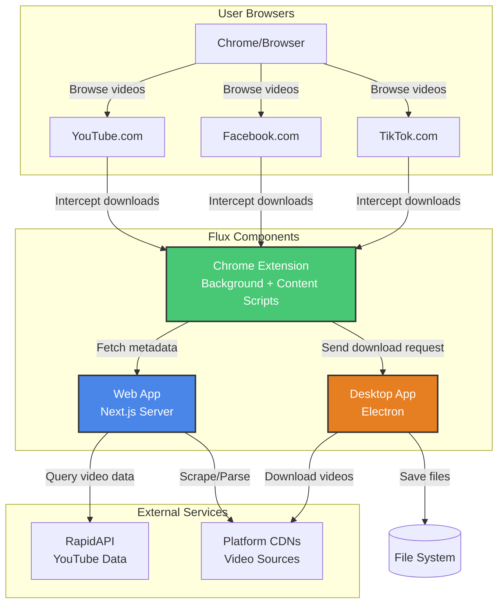

### Component Communication Flow

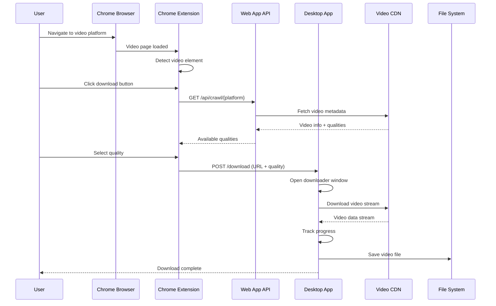

### Web App Workflow

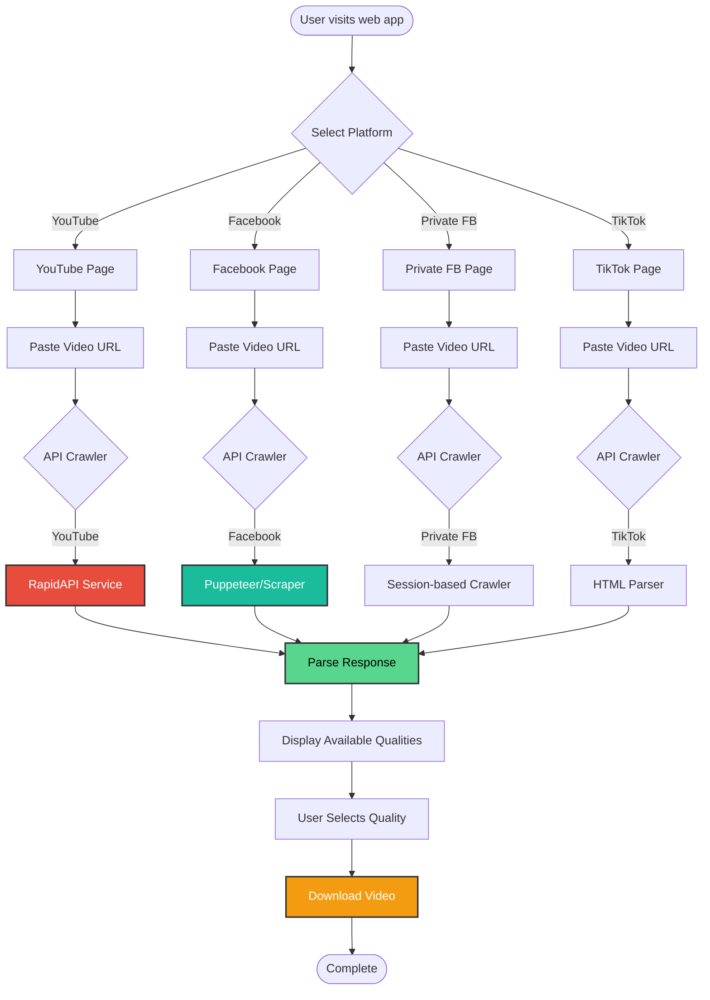

### Desktop App Workflow

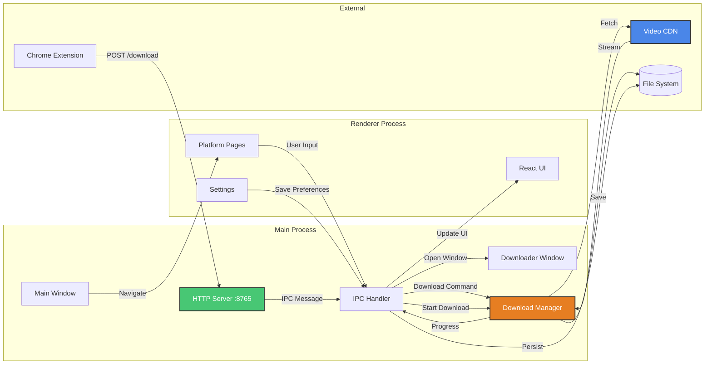

### Chrome Extension Workflow

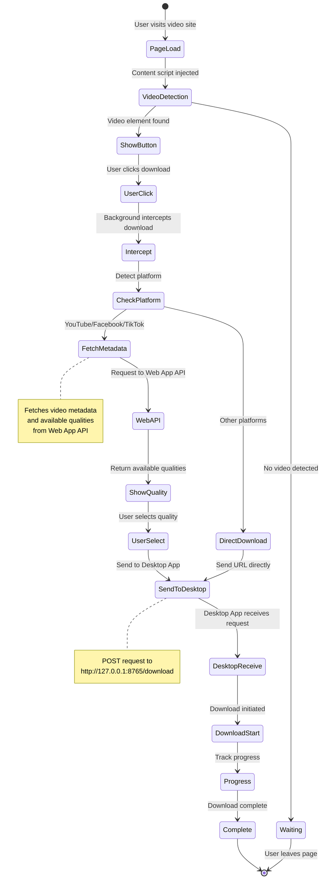

### Complete Download Flow

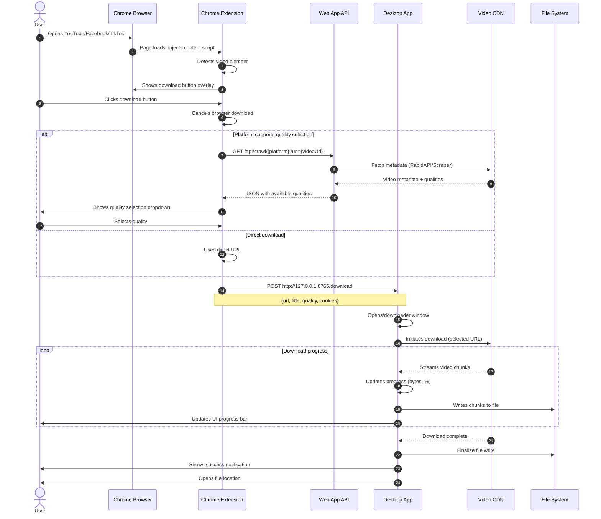

### API Communication Diagram

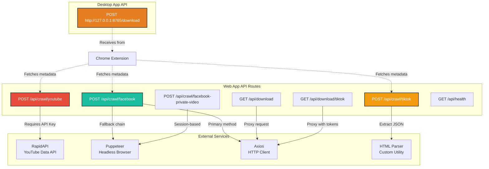

### How It Works - Step by Step

#### 1. Web App Download Process

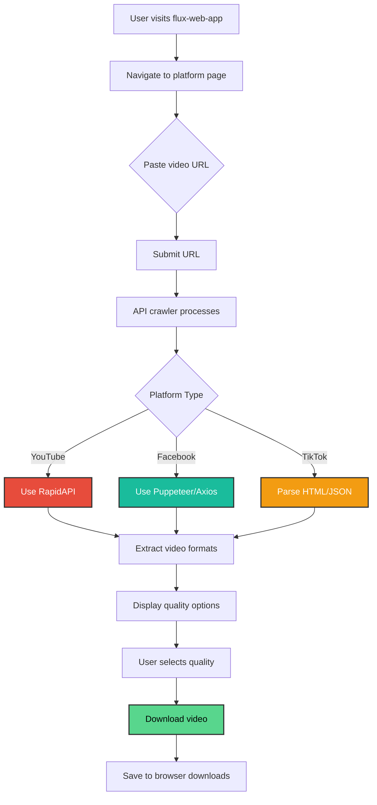

#### 2. Desktop App Download Process

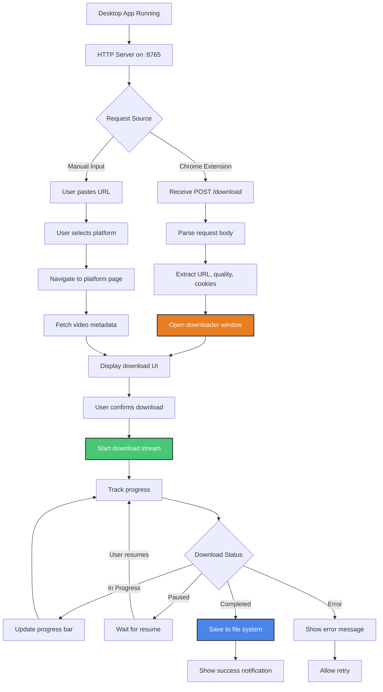

#### 3. Chrome Extension Interception Process

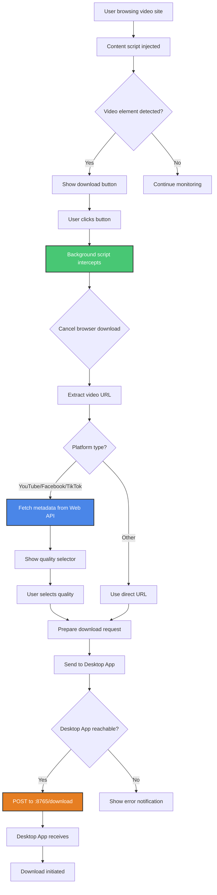

### API Endpoints

**Web App** (`/api/*`):

- `POST /api/crawl/youtube` - Fetch YouTube metadata and formats
- `POST /api/crawl/facebook` - Crawl Facebook public videos
- `POST /api/crawl/facebook-private-video` - Crawl Facebook private videos
- `POST /api/crawl/tiktok` - Scrape TikTok video data
- `GET /api/download` - Proxy Facebook video downloads
- `GET /api/download/tiktok` - Proxy TikTok video downloads
- `GET /api/health` - Health check endpoint

**Desktop App** (`http://127.0.0.1:8765`):

- `POST /download` - Receive download requests from Chrome extension

## 🔄 How It Works

### Overview

Flux is a distributed video downloading system with three interconnected components that can work independently or together:

1. **Web App**: Handles browser-based video downloads with server-side crawling
2. **Desktop App**: Manages downloads with advanced features (pause, resume, progress tracking)
3. **Chrome Extension**: Seamlessly integrates browser and desktop workflows

### Workflow Modes

#### Mode 1: Standalone Web App

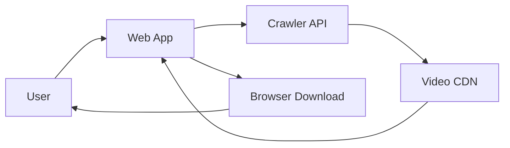

**Process:**

1. User visits web app and navigates to platform page (e.g., `/youtube`)
2. User pastes video URL
3. Frontend sends request to Next.js API route (`/api/crawl/{platform}`)
4. API crawler fetches video metadata using appropriate method:
   - **YouTube**: RapidAPI integration
   - **Facebook**: Puppeteer headless browser or Axios with HTML parsing
   - **TikTok**: HTML/JSON parsing from page source
5. API returns available video qualities and formats
6. User selects desired quality
7. Video downloads directly through browser or via proxy endpoint

#### Mode 2: Desktop App with Manual Input

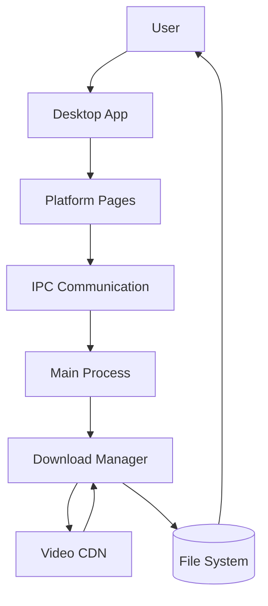

**Process:**

1. User opens desktop app
2. Navigates to platform page (YouTube, Facebook, TikTok, etc.)
3. Pastes video URL in input field
4. Desktop app processes URL and fetches metadata
5. User selects quality and download location
6. Download manager initiates download with progress tracking
7. User can pause, resume, or cancel downloads
8. Completed files saved to selected location

#### Mode 3: Chrome Extension + Desktop App Integration

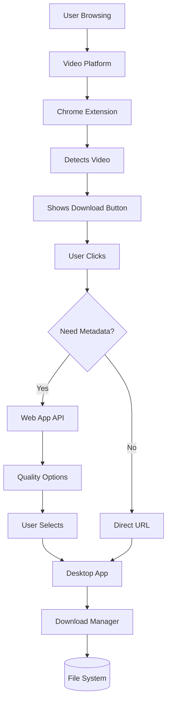

**Process:**

1. User browses YouTube/Facebook/TikTok in Chrome
2. Chrome extension content script injects into page
3. Extension detects video element and shows download button overlay
4. User clicks download button
5. Extension's background script intercepts browser download and cancels it
6. Extension identifies platform and extracts video URL
7. **If quality selection needed**: Extension fetches metadata from Web App API
8. Extension shows quality selector (if available)
9. User selects quality
10. Extension sends POST request to Desktop App at `http://127.0.0.1:8765/download`
11. Desktop App receives request and opens downloader window
12. Desktop App downloads video with progress tracking
13. Video saved to user's selected location

### Component Responsibilities

#### Web App Responsibilities

- **Crawling**: Fetch video metadata from platforms using various methods
- **Quality Extraction**: Parse available video formats and resolutions
- **Download Proxy**: Server-side proxy for platforms with CORS restrictions
- **API Service**: Provide RESTful API for other components (extension, desktop)

#### Desktop App Responsibilities

- **Download Management**: Handle video downloads with pause/resume/cancel
- **Progress Tracking**: Real-time progress updates (bytes, percentage)
- **File Management**: Save files to user-selected locations
- **HTTP Server**: Accept download requests from Chrome extension
- **Settings Storage**: Persist user preferences and configurations

#### Chrome Extension Responsibilities

- **Video Detection**: Identify video elements on web pages
- **Download Interception**: Cancel browser downloads and route to desktop app
- **Metadata Fetching**: Retrieve video quality options from Web App API
- **UI Integration**: Overlay download buttons and quality selectors
- **Communication**: Send download requests to Desktop App

### Data Flow

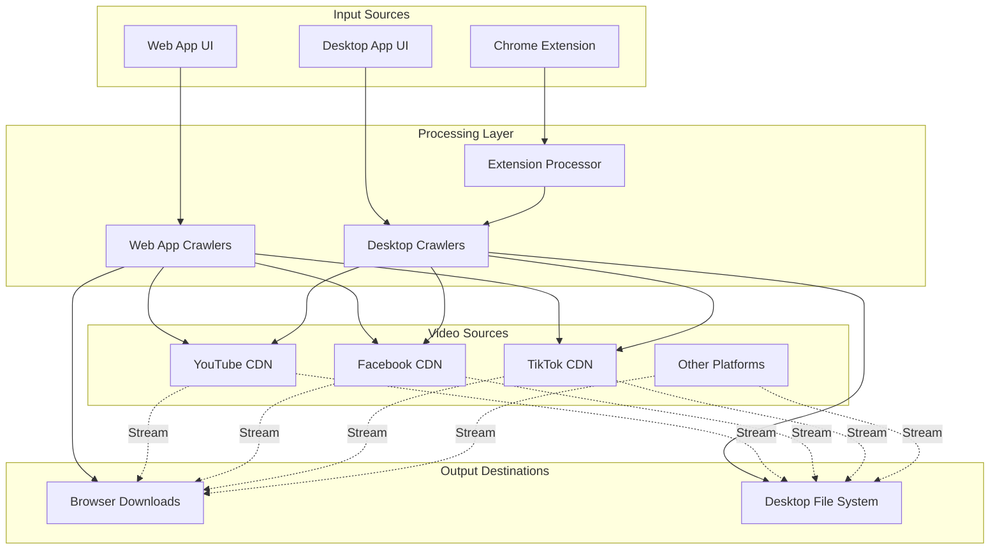

### Key Technologies & Their Roles

- **Next.js (Web App)**: Server-side rendering, API routes for crawling
- **Electron (Desktop App)**: Cross-platform desktop application, IPC communication
- **Puppeteer (Web App)**: Headless browser for scraping dynamic content
- **RapidAPI (Web App)**: External service for YouTube metadata
- **HTTP Server (Desktop App)**: Local server for extension communication
- **Chrome Extensions API**: Download interception, content scripts
- **React (All Components)**: UI framework for all three components
- **TypeScript**: Type safety across all components

## 🛠️ Development

### Available Scripts

**Web App:**

- `npm run dev` - Start development server
- `npm run build` - Build for production
- `npm run start` - Run production server
- `npm run lint` - Run ESLint

**Desktop App:**

- `npm run dev` - Start development server with hot reload
- `npm run build` - Build for production (includes Electron Builder)
- `npm run lint` - Run ESLint

**Chrome Extension:**

- `npm run dev` - Start development server with hot-reload
- `npm run build` - Build extension for production
- `npm run preview` - Preview the built extension

### Building for Production

**Desktop App:**

```bash
cd flux-desktop-app
npm run build
```

Builds are output to `release/{version}/` directory for Windows, macOS, and Linux.

**Web App:**

```bash
cd flux-web-app
npm run build
npm run start
```

**Chrome Extension:**

```bash
cd flux-chrome-extension
npm run build
```

The built extension is in the `dist/` directory.

## 🤝 Contributing

We welcome contributions! Please see [CONTRIBUTING.md](CONTRIBUTING.md) for detailed guidelines on:

- Code of conduct
- Development setup
- Coding standards
- Git workflow
- Pull request process
- Testing guidelines

### Quick Contribution Guide

1. Fork the repository
2. Create a feature branch (`git checkout -b feature/amazing-feature`)
3. Make your changes following the coding standards
4. Test your changes
5. Commit your changes (`git commit -m 'feat: add amazing feature'`)
6. Push to the branch (`git push origin feature/amazing-feature`)
7. Open a Pull Request

## 📝 License

This project is licensed under the MIT License - see the [LICENSE](LICENSE) file for details.

Copyright (c) 2025 Shakib Khan

## 📚 Documentation

For more detailed information about each component, see:

- [flux-web-app/README.md](flux-web-app/README.md) - Web application documentation
- [flux-desktop-app/README.md](flux-desktop-app/README.md) - Desktop application documentation
- [flux-chrome-extension/README.md](flux-chrome-extension/README.md) - Chrome extension documentation

## 🙏 Acknowledgments

- Built with [Next.js](https://nextjs.org/), [Electron](https://www.electronjs.org/), and [React](https://react.dev/)
- UI components from [shadcn/ui](https://ui.shadcn.com/)
- Icons from [Lucide](https://lucide.dev/)

## 📮 Support

For issues, questions, or contributions, please open an issue on GitHub or refer to the [CONTRIBUTING.md](CONTRIBUTING.md) guide.
